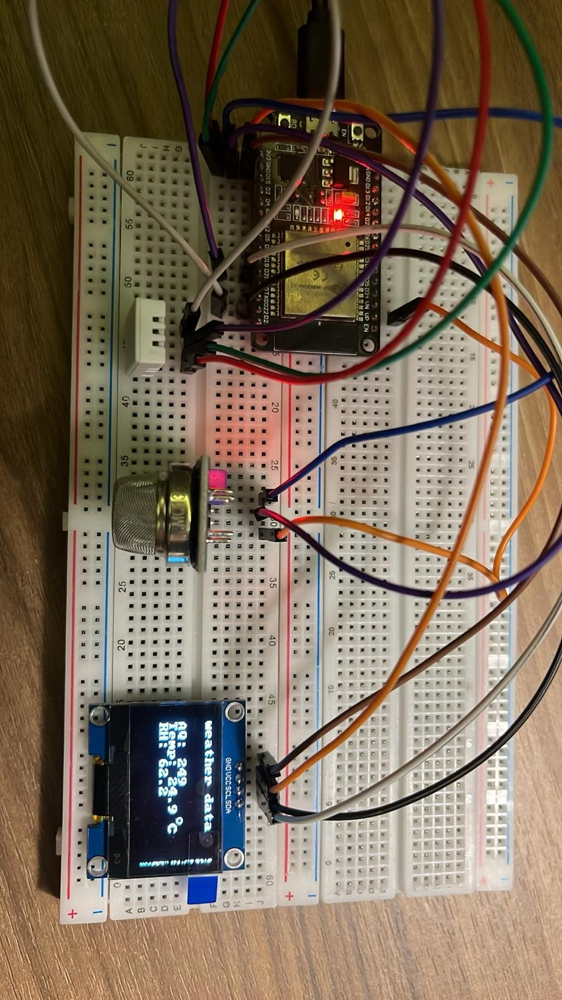

# weather-box

### ESP32-WROOM-32 + MQ135 + SHTC3 + OLED (SH1106 chip) + (BMP280)



SDA 21
SCL 22
ADC 36

To test

```
git clone https://github.com/rickhalz/weeather-box.git
cd weeather-box
idf.py build && idf.py flash
```
